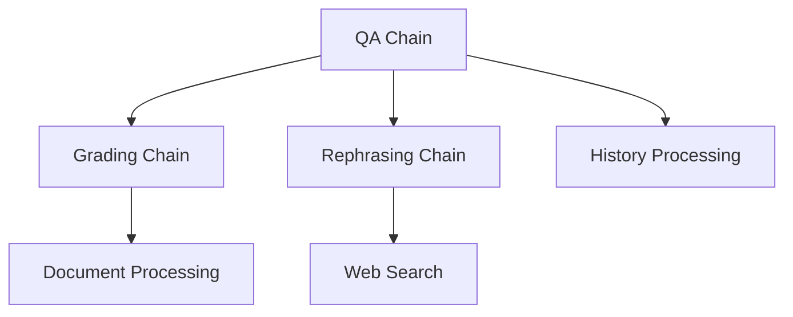

# Chains Documentation

## Overview

The system implements several specialized LangChain chains for different processing needs, with integrated support for conversation history and session management:



## Chain Types

### 1. QA Chain

**Purpose**: Generates answers using context documents, specialized prompts, and conversation history.

**Implementation**:
```python
class QAChain:
    def __init__(self):
        self.chains = {
            "base": self._build_chain(BASE_QA_PROMPT),
            "python": self._build_chain(PYTHON_QA_PROMPT),
            "mechatronic": self._build_chain(MECHATRONIC_QA_PROMPT)
        }
        
    def invoke(self, 
               question: str, 
               context: List[Document], 
               agent_type: str = "base",
               history: List = None) -> str:
        """Generate answer with history context"""
```

**Key Features**:
- Specialized prompts for different agents
- Document context integration
- Structured output parsing
- Conversation history integration
- Dynamic prompt selection

### 2. Grading Chain

**Purpose**: Evaluates document relevance to queries.

**Implementation**:
```python
class DocumentGrader:
    def grade_document(self, question: str, document: Document) -> bool:
        """Grade document with structured output"""
        result = self.chain.invoke({
            "question": question,
            "document": document.page_content
        })
        return result.binary_score.lower() == "yes"
```

**Features**:
- Binary relevance scoring
- Structured output validation
- Batch processing capability
- Comprehensive logging
- Error handling

### 3. Rephrasing Chain

**Purpose**: Optimizes queries for web search.

**Implementation**:
```python
class QueryRephraser:
    def rephrase(self, question: str) -> str:
        """Optimize query for web search"""
        return self.chain.invoke({"question": question})
```

**Features**:
- Query optimization
- Semantic understanding
- Web search preparation
- Error handling
- Performance monitoring

## Chain Components

### 1. Prompts
Each chain uses specialized prompts with history integration:
```python
PYTHON_QA_TEMPLATE = """You are an expert Python programmer.

Previous conversation:
{history}

Context: {context}

Question: {question}

Provide a detailed response with code examples where appropriate."""
```

### 2. Models
Structured output models for validation:
```python
class GradeDocuments(BaseModel):
    binary_score: str = Field(
        description="Documents are relevant to the question, 'yes' or 'no'"
    )
    
    @field_validator('binary_score')
    def validate_score(cls, v):
        """Validate binary score value"""
```

### 3. Output Parsers
```python
chain = (
    {
        "context": format_docs,
        "question": itemgetter("question"),
        "history": itemgetter("history")
    }
    | prompt 
    | self.llm 
    | StrOutputParser()
)
```

## Usage Examples

### QA Chain with History
```python
# Initialize chain
qa_chain = QAChain()

# Get history from session
history = chat_session.get_chat_history({"query": question})

# Generate answer
answer = qa_chain.invoke(
    question="How do I implement binary search?",
    context=documents,
    agent_type="python",
    history=history
)
```

### Document Grading
```python
grader = DocumentGrader()
is_relevant = grader.grade_document(question, document)
```

### Query Rephrasing
```python
rephraser = QueryRephraser()
optimized_query = rephraser.rephrase("How to make cake?")
```

## Best Practices

1. **Chain Construction**:
   - Use factory methods for complex chains
   - Implement proper error handling
   - Add comprehensive logging
   - Handle history appropriately
   - Monitor performance

2. **Prompt Management**:
   - Keep prompts in separate files
   - Use templates for consistency
   - Document prompt purpose and structure
   - Include history placeholders
   - Validate prompt outputs

3. **Output Handling**:
   - Validate outputs using Pydantic models
   - Implement proper error handling
   - Log outputs for debugging
   - Handle history references
   - Clean malformed outputs

4. **Performance**:
   - Use async where appropriate
   - Implement caching for expensive operations
   - Monitor token usage
   - Optimize history usage
   - Handle large contexts

## Error Handling

All chains implement error handling for:
- Invalid inputs
- LLM errors
- Parsing errors
- Output validation
- History processing errors
- Resource management

## Logging

Comprehensive logging with context:
```python
self.logger.info(f"Processing query: {query}")
self.logger.debug(f"Using context: {len(documents)} documents")
self.logger.debug(f"History length: {len(history)} messages")
self.logger.error(f"Error in processing: {str(e)}", exc_info=True)
```

## History Integration

### History Format
```python
history_format = {
    "messages": List[ChatMessage],
    "metadata": Dict[str, Any],
    "timestamp": datetime
}
```

### History Processing
```python
def _format_history(self, history: List) -> str:
    """Format conversation history for prompt"""
    if not history:
        return "No previous conversation."
    return "\n".join([f"{msg.type}: {msg.content}" 
                     for msg in history])
```

## Performance Optimization

### Caching Strategy
- LLM response caching
- Document grading caching
- History processing optimization
- Resource pooling
- Memory management

### Resource Management
- Token usage monitoring
- Rate limiting
- Connection pooling
- Error recovery
- Cleanup procedures