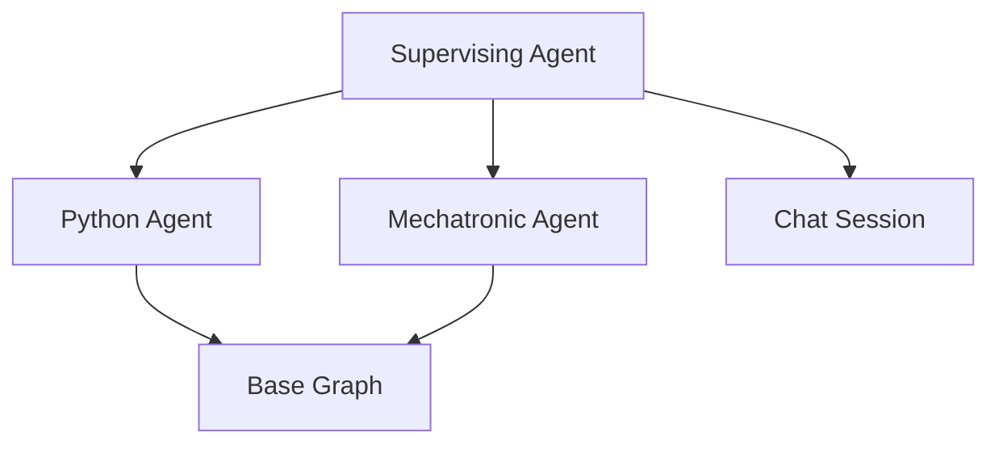

# Agents Documentation

## Overview

The agent system uses a hierarchical structure with a supervising agent that routes queries to specialized agents. The system now includes session management and conversation history support.



## Base Agent

### Purpose
Provides the core functionality for all specialized agents including:
- Document retrieval
- Answer generation
- Web search fallback
- Session management
- Conversation history

### Implementation
```python
class BaseAgent(ABC):
    def __init__(self, config: AgentConfig, session=None):
        """
        Initialize agent with configuration and session support.
        
        Args:
            config (AgentConfig): Agent configuration
            session (Optional[ChatSession]): Chat session for history
        """
        self.session = session
        self.name = config.name
        self.description = config.description
        self.expertise = config.expertise
        self.tools = config.tools
        
    async def answer_question(self, query: str) -> str:
        """Process query through graph with conversation history"""
```

### Key Concepts
1. **Abstract Base Class**: Used to enforce implementation of required methods
2. **Graph-Based Processing**: Uses StateGraph for workflow
3. **Async Processing**: Enables concurrent operations
4. **Session Support**: Maintains conversation context
5. **History Integration**: Uses chat history for better responses

## Supervising Agent

### Purpose
Routes incoming queries to the most appropriate specialized agent.

### Implementation
```python
class SupervisingAgent(BaseAgent):
    def __init__(self, specialized_agents: List[BaseAgent], session=None):
        """Initialize with agents and session support"""
        
    async def route_query(self, query: str) -> BaseAgent:
        """Route to appropriate agent using LLM and confidence scoring"""
        
    async def process(self, query: str, context: Dict[str, Any] = None) -> str:
        """Process query with history and context"""
```

### Key Features
1. **LLM-Based Routing**: Uses LLM for intelligent routing
2. **Fallback Mechanism**: Uses confidence scores as backup
3. **Agent Management**: Manages multiple specialized agents
4. **Session Handling**: Maintains conversation continuity
5. **History Integration**: Considers previous interactions

## Specialized Agents

### Python Agent
Handles programming-related queries:
- Algorithm implementations
- Code optimization
- Best practices
- Programming concepts
- Development guidelines

### Mechatronic Agent
Handles hardware and engineering queries:
- Robotics design
- Electronic systems
- Mechanical systems
- Control systems
- Hardware integration

## State Management

The agent system uses TypedDict for state management:
```python
class AgentGraphState(TypedDict):
    question: str
    generation: str
    web_search_needed: str
    documents: List[Document]
    agent_name: str
```

## Processing Flow

1. Query Reception & Session Creation
2. History Retrieval
3. Query Routing
4. Document Retrieval
5. Document Grading
6. Answer Generation/Web Search
7. Response Formation
8. History Update

## Usage Examples

### Basic Usage with Session
```python
# Initialize chat session
chat_session = ChatSession(supervising_agent, "user_123")

# Create supervising agent with session
supervising_agent = SupervisingAgent(
    [python_agent, mechatronic_agent],
    session=chat_session
)

# Process query
response = await supervising_agent.process("How do I implement quicksort?")
```

### Direct Agent Usage with Session
```python
# Initialize agent with session
python_agent = PythonAgent(session=chat_session)

# Process with history context
response = await python_agent.process("Explain binary trees")
```

## Error Handling

All agents implement comprehensive error handling:
- Input validation
- Processing errors
- Resource management
- Logging
- Session errors
- History management errors

## Best Practices

1. Always use async/await for agent methods
2. Implement proper error handling
3. Use logging for debugging
4. Follow the established state management pattern
5. Properly initialize sessions
6. Clean up resources and sessions
7. Handle conversation history appropriately

## Configuration

Agents use structured configuration:
```python
@dataclass
class AgentConfig:
    name: str
    description: str
    expertise: List[str]
    tools: List[str]
```

## Session Integration

### Session Management
- Each agent maintains a session reference
- Sessions track conversation history
- History is used for context in responses

### History Usage
```python
# Get history in agent
if self.session:
    history = self.session.get_chat_history({"query": query})
    # Use history in response generation
```

## Monitoring and Logging

Comprehensive logging is implemented:
```python
self.logger.info(f"Processing query: {query}")
self.logger.debug(f"Retrieved history: {len(history)} messages")
self.logger.error(f"Error in processing: {str(e)}", exc_info=True)
```