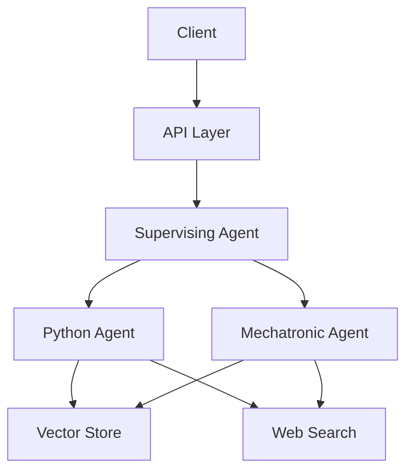

# API Documentation

## Overview

The Multi-Agent System API provides RESTful endpoints for interacting with specialized AI agents. The API is built using FastAPI and supports three main agent types: Python Agent, Mechatronic Agent, and a Supervising Agent.



## Base URL

```
http://localhost:8000/api/v1
```

## Endpoints

### Health Check
```http
GET /health
```
Check API service health status.

#### Response
```json
{
    "status": "healthy",
    "service": "Multi-Agent API"
}
```

### Python Agent

#### Chat with Python Agent
```http
POST /python/chat
```

Process Python-related queries and get responses.

**Request Body**
```json
{
    "message": "How do I implement a binary search tree?",
    "session_id": "optional-session-id",
    "context": {}
}
```

**Response**
```json
{
    "message": "Here's how to implement a binary search tree...",
    "agent_name": "Python Coder",
    "session_id": "optional-session-id",
    "metadata": {
        "expertise": ["python", "algorithms", "data structures"],
        "domain": "python_programming"
    }
}
```

#### Analyze Code
```http
POST /python/analyze
```

Analyze Python code for best practices and improvements.

**Request Body**
```json
{
    "code": "def example():\n    print('hello')",
    "session_id": "optional-session-id",
    "context": {}
}
```

**Response**
```json
{
    "code": "def example():\n    print('hello')",
    "analysis": "Analysis of the code...",
    "agent_name": "Python Coder",
    "metadata": {
        "expertise": ["python", "code review"],
        "type": "code_analysis"
    }
}
```

### Mechatronic Agent

#### Chat with Mechatronic Agent
```http
POST /mechatronic/chat
```

Process mechatronics and hardware-related queries.

**Request Body**
```json
{
    "message": "How do I design a robotic arm?",
    "session_id": "optional-session-id",
    "context": {}
}
```

**Response**
```json
{
    "message": "To design a robotic arm...",
    "agent_name": "Mechatronic Engineer",
    "session_id": "optional-session-id",
    "metadata": {
        "expertise": ["robotics", "mechanical systems"],
        "domain": "mechatronics"
    }
}
```

### Supervising Agent

#### Route Query
```http
POST /supervisor/chat
```

Route query to the most appropriate specialized agent.

**Request Body**
```json
{
    "message": "What is the best way to implement sensor integration?",
    "session_id": "optional-session-id",
    "context": {}
}
```

**Response**
```json
{
    "message": "[Mechatronic Engineer]: For sensor integration...",
    "agent_name": "Supervisor",
    "session_id": "optional-session-id",
    "metadata": {
        "routed": true,
        "selected_agent": "Mechatronic Engineer"
    }
}
```

#### Analyze Routing
```http
GET /supervisor/route-analysis?query=How do I implement a Python algorithm?
```

Analyze how a query would be routed without executing it.

**Response**
```json
{
    "selected_agent": "Python Coder",
    "confidence_scores": {
        "Python Coder": 0.85,
        "Mechatronic Engineer": 0.2
    },
    "query": "How do I implement a Python algorithm?"
}
```

## Error Handling

All endpoints use consistent error responses:

```json
{
    "error": "Error message",
    "code": "ERROR_CODE",
    "details": {
        "message": "Detailed error information"
    }
}
```

Common Error Codes:
- `PYTHON_AGENT_ERROR`: Errors from Python Agent
- `MECHATRONIC_AGENT_ERROR`: Errors from Mechatronic Agent
- `SUPERVISOR_ERROR`: Errors from Supervising Agent
- `INITIALIZATION_ERROR`: Agent initialization failures

## Request/Response Logging

All API requests are logged with:
- Request ID
- Method and URL
- Request body (if present)
- Response status
- Processing time

Example log output:
```
[INFO] Request [1234] Started
[INFO] Request [1234] URL: /api/v1/python/chat
[INFO] Request [1234] Method: POST
[INFO] Request [1234] Completed in 0.543s
[INFO] Request [1234] Status: 200
```

## Best Practices

1. **Session Management**
   - Use consistent session IDs for related requests
   - Include session ID in requests that need context

2. **Error Handling**
   - Always check response status codes
   - Handle error responses appropriately
   - Review error details for debugging

3. **Rate Limiting**
   - Implement appropriate request throttling
   - Handle 429 (Too Many Requests) responses

4. **Performance**
   - Keep request payloads minimal
   - Use appropriate endpoints for specific tasks
   - Monitor response times

## Example Usage

Using Python requests:
```python
import requests

# Chat with Python Agent
response = requests.post(
    "http://localhost:8000/api/v1/python/chat",
    json={
        "message": "How do I implement quicksort?",
        "session_id": "user123",
        "context": {}
    }
)

print(response.json())
```

Using curl:
```bash
# Health check
curl http://localhost:8000/health

# Chat with Python Agent
curl -X POST http://localhost:8000/api/v1/python/chat \
    -H "Content-Type: application/json" \
    -d '{"message": "How do I implement quicksort?", "session_id": "user123"}'
```