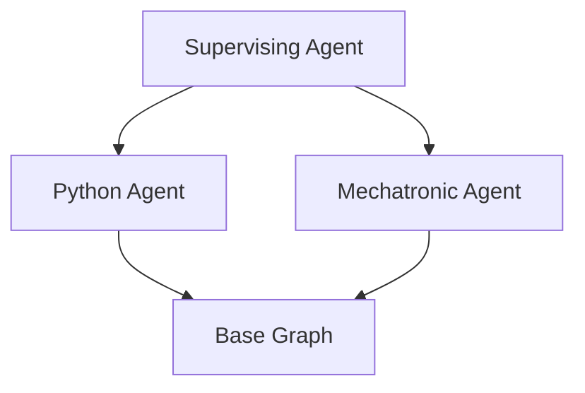

# Agents Documentation

## Overview

The agent system uses a hierarchical structure with a supervising agent that routes queries to specialized agents.



## Base Agent

### Purpose
Provides the core functionality for all specialized agents including:
- Document retrieval
- Answer generation
- Web search fallback

### Implementation
```python
class BaseAgent(ABC):
    def __init__(self, config: AgentConfig):
        # Initialize agent
        
    async def answer_question(self, query: str) -> str:
        # Process query through graph
```

### Key Concepts
1. **Abstract Base Class**: Used to enforce implementation of required methods
2. **Graph-Based Processing**: Uses StateGraph for workflow
3. **Async Processing**: Enables concurrent operations

## Supervising Agent

### Purpose
Routes incoming queries to the most appropriate specialized agent.

### Implementation
```python
class SupervisingAgent(BaseAgent):
    async def route_query(self, query: str) -> BaseAgent:
        # Route to appropriate agent
```

### Key Features
1. **LLM-Based Routing**: Uses LLM for intelligent routing
2. **Fallback Mechanism**: Uses confidence scores as backup
3. **Agent Management**: Manages multiple specialized agents

## Specialized Agents

### Python Agent
Handles programming-related queries:
- Algorithm implementations
- Code optimization
- Best practices

### Mechatronic Agent
Handles hardware and engineering queries:
- Robotics design
- Electronic systems
- Mechanical systems

## State Management

The agent system uses TypedDict for state management:
```python
class AgentGraphState(TypedDict):
    question: str
    generation: str
    web_search_needed: str
    documents: List[Document]
    agent_name: str
```

## Processing Flow

1. Query Reception
2. Query Routing
3. Document Retrieval
4. Document Grading
5. Answer Generation/Web Search
6. Response Formation

## Usage Examples

### Basic Usage
```python
supervising_agent = SupervisingAgent([python_agent, mechatronic_agent])
response = await supervising_agent.process("How do I implement quicksort?")
```

### Direct Agent Usage
```python
python_agent = PythonAgent()
response = await python_agent.process("Explain binary trees")
```

## Error Handling

All agents implement comprehensive error handling:
- Input validation
- Processing errors
- Resource management
- Logging

## Best Practices

1. Always use async/await for agent methods
2. Implement proper error handling
3. Use logging for debugging
4. Follow the established state management pattern