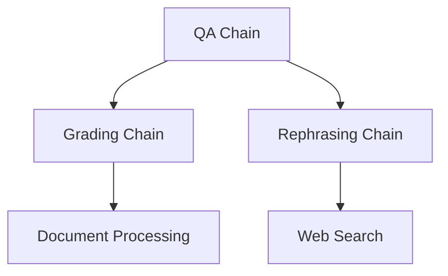

# Chains Documentation

## Overview

The system implements several specialized LangChain chains for different processing needs:



## Chain Types

### 1. QA Chain

**Purpose**: Generates answers using context documents and specialized prompts.

**Implementation**:
```python
class QAChain:
    def __init__(self):
        self.chains = {
            "base": self._build_chain(BASE_QA_PROMPT),
            "python": self._build_chain(PYTHON_QA_PROMPT),
            "mechatronic": self._build_chain(MECHATRONIC_QA_PROMPT)
        }
```

**Key Features**:
- Specialized prompts for different agents
- Document context integration
- Structured output parsing

### 2. Grading Chain

**Purpose**: Evaluates document relevance to queries.

**Implementation**:
```python
class DocumentGrader:
    def grade_document(self, question: str, document: Document) -> bool:
        result = self.chain.invoke({
            "question": question,
            "document": document.page_content
        })
        return result.binary_score.lower() == "yes"
```

**Features**:
- Binary relevance scoring
- Structured output validation
- Batch processing capability

### 3. Rephrasing Chain

**Purpose**: Optimizes queries for web search.

**Implementation**:
```python
class QueryRephraser:
    def rephrase(self, question: str) -> str:
        return self.chain.invoke({"question": question})
```

**Features**:
- Query optimization
- Semantic understanding
- Web search preparation

## Chain Components

### 1. Prompts
Each chain uses specialized prompts:
```python
GRADING_PROMPT = ChatPromptTemplate.from_messages([
    ("system", GRADING_SYSTEM_PROMPT),
    ("human", QUERY_TEMPLATE)
])
```

### 2. Models
Structured output models for validation:
```python
class GradeDocuments(BaseModel):
    binary_score: str = Field(
        description="Documents are relevant to the question, 'yes' or 'no'"
    )
```

### 3. Output Parsers
```python
chain = prompt | self.llm | StrOutputParser()
```

## Usage Examples

### QA Chain
```python
qa_chain = QAChain()
answer = qa_chain.invoke(
    question="How do I implement binary search?",
    context=documents,
    agent_type="python"
)
```

### Document Grading
```python
grader = DocumentGrader()
is_relevant = grader.grade_document(question, document)
```

### Query Rephrasing
```python
rephraser = QueryRephraser()
optimized_query = rephraser.rephrase("How to make cake?")
```

## Best Practices

1. **Chain Construction**:
   - Use factory methods for complex chains
   - Implement proper error handling
   - Add comprehensive logging

2. **Prompt Management**:
   - Keep prompts in separate files
   - Use templates for consistency
   - Document prompt purpose and structure

3. **Output Handling**:
   - Validate outputs using Pydantic models
   - Implement proper error handling
   - Log outputs for debugging

4. **Performance**:
   - Use async where appropriate
   - Implement caching for expensive operations
   - Monitor token usage

## Error Handling

All chains implement error handling for:
- Invalid inputs
- LLM errors
- Parsing errors
- Output validation

## Logging

Each chain includes comprehensive logging:
```python
self.logger.info(f"Processing query: {query}")
self.logger.debug(f"Using context: {len(documents)} documents")
self.logger.error(f"Error in processing: {str(e)}")
```