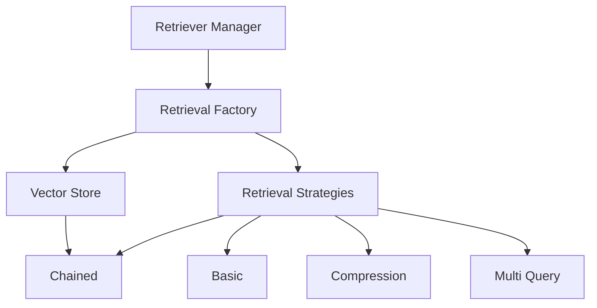

# Retrievers Documentation

## Overview

The retrieval system implements a sophisticated document retrieval mechanism using vector stores and multiple retrieval strategies.

## Architecture



## Components

### 1. RetrieverManager (Singleton)

**Purpose**: Manages retriever instances for different agents.

**Implementation**:
```python
class RetrieverManager:
    _instances: Dict = {}  # Cache for retriever instances
    
    @classmethod
    def get_retriever(cls, agent_name: str):
        if agent_name not in cls._instances:
            vector_store = Chroma(...)
            retriever = RetrievalFactory(vector_store).create_retriever(...)
            cls._instances[agent_name] = retriever
```

**Features**:
- Singleton pattern for resource management
- Lazy initialization
- Per-agent caching

### 2. RetrievalFactory

**Purpose**: Creates different types of retrievers based on strategy.

**Implementation**:
```python
class RetrievalFactory:
    def create_retriever(self, strategy: RetrievalStrategy, k: int = 3):
        base_retriever = self.vector_store.as_retriever(...)
        
        if strategy == RetrievalStrategy.CHAINED:
            # Build chained retriever
            return self._build_chained_retriever(base_retriever, k)
```

### 3. Retrieval Strategies

```python
class RetrievalStrategy(Enum):
    BASIC = "basic"                    # Simple similarity search
    COMPRESSION = "compression"         # With LLM filtering
    MULTI_QUERY = "multi_query"        # Multiple query variations
    CHAINED = "chained"                # Full pipeline
```

## Retrieval Pipeline

### 1. Basic Retrieval
```python
base_retriever = vector_store.as_retriever(
    search_type="similarity",
    search_kwargs={"k": k}
)
```

### 2. Compression Retrieval
```python
compression_retriever = ContextualCompressionRetriever(
    base_compressor=filter_chain,
    base_retriever=base_retriever
)
```

### 3. Chained Retrieval
```python
final_retriever = ContextualCompressionRetriever(
    base_compressor=reranker_compressor,
    base_retriever=compression_retriever
)
```

## Usage Examples

### Basic Usage
```python
retriever = RetrieverManager.get_retriever("python_agent")
documents = retriever.get_relevant_documents(query)
```

### Custom Strategy
```python
factory = RetrievalFactory(vector_store)
retriever = factory.create_retriever(
    strategy=RetrievalStrategy.MULTI_QUERY,
    k=5
)
```

## Vector Store Management

### Initialization
```python
def initialize_agent_vector_stores(base_dir: str = "VITA"):
    for agent_name in agents:
        data_manager = AgentDataManager(agent_name, base_dir)
        data_manager.create_or_load_vector_store(force_reload=True)
```

### Document Processing
```python
chunked_docs = text_splitter.split_documents(documents)
vector_store = Chroma.from_documents(
    documents=chunked_docs,
    embedding=embedding_model
)
```

## Best Practices

1. **Resource Management**:
   - Use RetrieverManager for caching
   - Implement proper cleanup
   - Monitor memory usage

2. **Strategy Selection**:
   - Use CHAINED strategy for best results
   - Consider BASIC for simple queries
   - Use MULTI_QUERY for complex queries

3. **Error Handling**:
   - Handle vector store connection errors
   - Implement retry logic
   - Log all operations

4. **Performance**:
   - Use appropriate chunk sizes
   - Implement caching
   - Monitor retrieval times

## Error Handling

The retrieval system handles:
- Vector store connection errors
- Document processing errors
- Strategy creation errors
- Resource cleanup

## Logging

Comprehensive logging is implemented:
```python
self.logger.info(f"Creating retriever for {agent_name}")
self.logger.debug(f"Using strategy: {strategy}")
self.logger.error(f"Failed to initialize: {str(e)}")
```